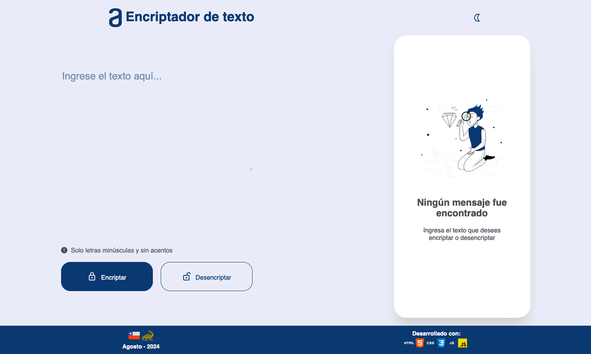
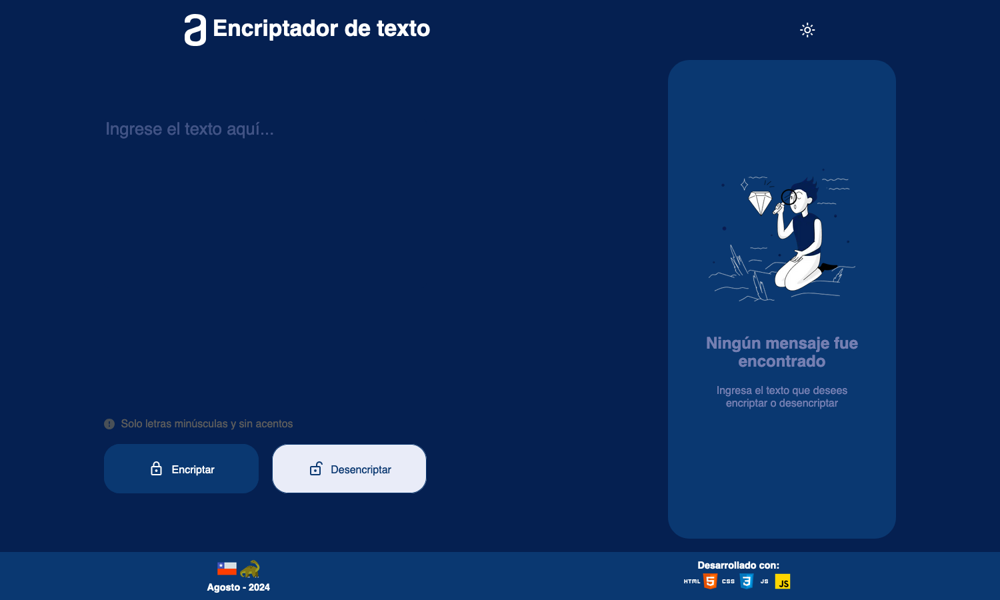
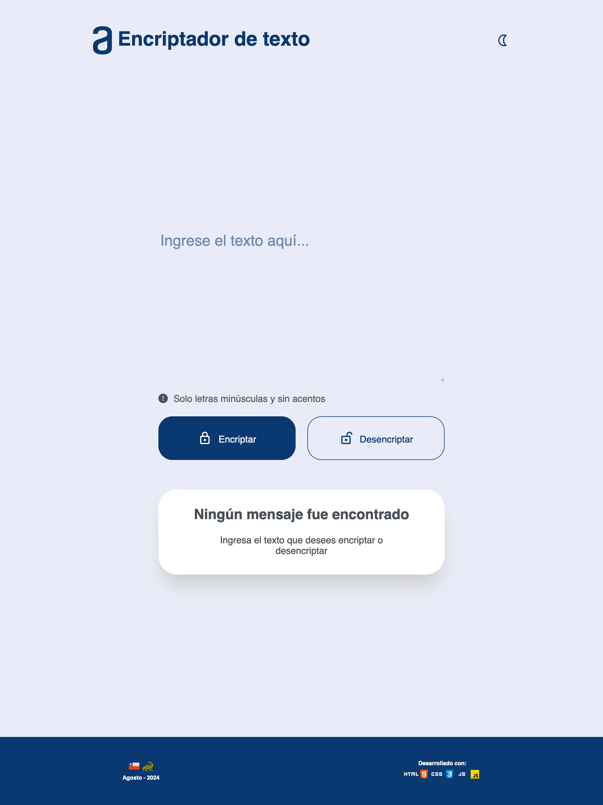
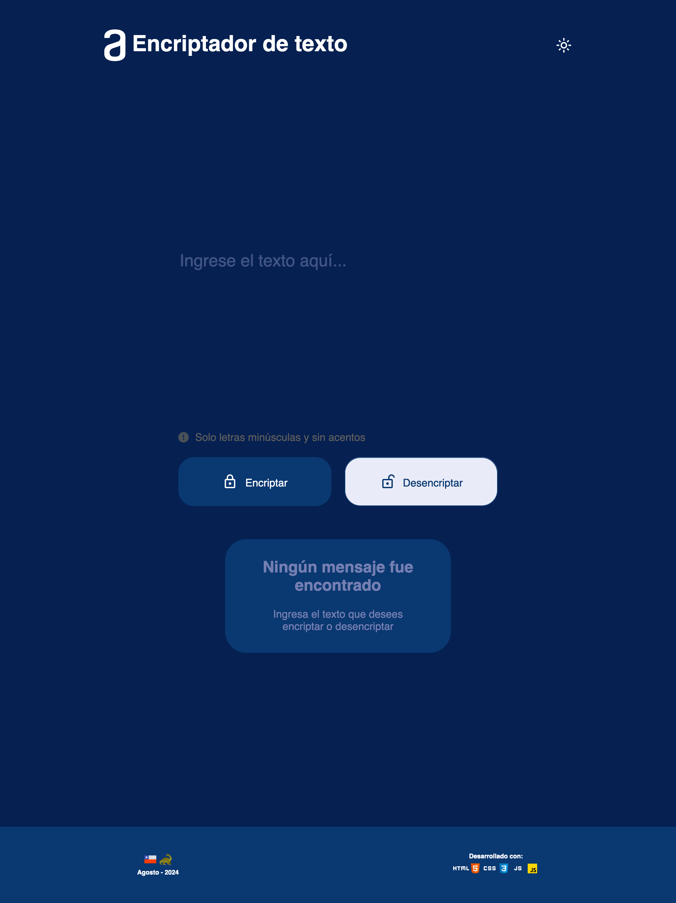
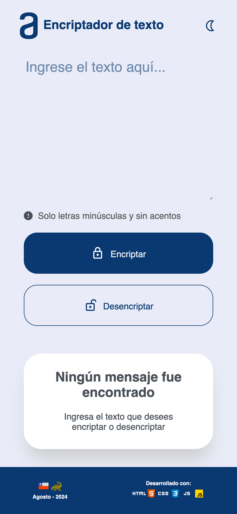
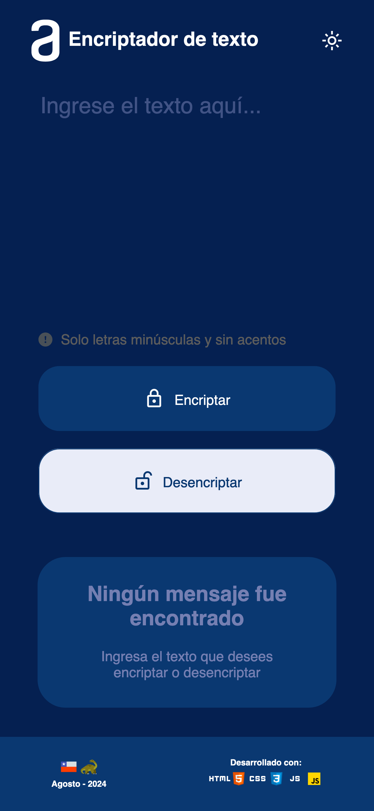

<h1 align="center"> Challenge Encriptador</h1>
<p align="left">

</p>

# ¡Bienvenido a mi proyecto en Oracle Next Education!



---

## Índice

* [Descripción](#descripcion)

* [Objetivos](#objetivos)

* [Estado del proyecto](#estado)

* [Cómo usar](#uso)

* [Formato de encriptado](#formato)

* [Screenshots](#screenshots)

* [Tecnologías utilizadas](#tecnologias)

* [Compatibilidad](#compatibilidad)

* [Autor](#autor)

* [Licencia](#licencia)

---

<h2 id="descripcion">Descripción:</h2>
Challenge Encriptador es un proyecto desarrollado para el programa ONE (Oracle Next Education), como parte de la formación de Alura Latam.

Su función es ser una web app con capacidad de encriptar y desencriptar un texto, junto con la opción de poder copiar el texto resultante.

Fue construída con diseño adaptativo o **responsive design** que le permite presentarse desde un sitio web para diferentes tamaños de pantalla. Se utilizó la técnica de cambiar de resolución de pantalla desde la etiqueta *head* en el archivo `index.html`, generando un archivo CSS individual para cada resolución (**Mobile**, **Tablet** y **Desktop**) y así aumentar la velocidad de carga del sitio web, junto con una base de Normalize-css para mantener los estilos similares en los navegadores, ya que cada uno agrega sus propios estilos por defecto. 
Las resoluciones son las siguientes:

* **Mobile:** 0 - 599px. `style.css`
* **Tablets:** 600px - 1099px. `style1-tablet.css`
* **Desktop:** 1100px. `style2-desktop.css`

<h5>Etiqueta head</h5>

```
<head>
  <meta charset="UTF-8">
  <meta name="viewport" content="width=device-width, initial-scale=1.0">
  <link rel="stylesheet" href="./styles/normalize.css">
  <link rel="stylesheet" href="https://fonts.googleapis.com/css2?family=Material+Symbols+Outlined:opsz,wght,FILL,GRAD@24,400,0,0" />
  <link rel="stylesheet" href="./styles/style.css">
  <link rel="stylesheet" href="./styles/style1-tablet.css" media="(min-width: 600px)">
  <link rel="stylesheet" href="./styles/style2-desktop.css" media="(min-width: 1100px)">
  <link rel="icon" href="./assets/icons/favicon.ico" />
  <title>Encriptador de Texto</title>
</head>
```
---
<h2 id="objetivos">Objetivos y funcionalidad del proyecto:</h2>

El usuario debe ser capaz de encriptar o desencriptar un texto, siempre y cuando cumpla con **solo llevar minúsculas y sin acentos**. Además debe ser capaz de poder visualizarlo desde el navegador web de un dispositivo **mobile**, **tablet** o **desktop**.

<h5>🔨 Funcionalidades del proyecto </h4>

- `Funcionalidad 1`: Encriptar texto 🔒
- `Funcionalidad 2`: Desencriptar texto 🔓
- `Funcionalidad 3`: Copiar texto 🪞
- `Funcionalidad 4`: Light/Dark Mode 🌙

---
<h2 id="estado">Estado del proyecto:</h2>
<h4>Completado ✅</h4>

---
<h2 id="uso">Cómo usar:</h2>

1. Ingrese un texto que cumpla con estar en minúscula y sin caracteres especiales. Ambos botones se desactivan cuando no se cumple.
2. Seleccione si desea encriptar o desencriptar el texto.
3. Revise la información entregada a traves del cuadro de respuesta.
4. Si quiere, puede copiar el texto con el botón "Copiar" que aparece en la parte inferior una vez usada la aplicación.

---
<h2 id="formato">Formato de encriptado: 📟</h2>

La letra "e" es convertida para "enter".
La letra "i" es convertida para "imes".
La letra "a" es convertida para "ai".
La letra "o" es convertida para "ober".
La letra "u" es convertida para "ufat".

<h4>Por ejemplo:</h4>
"gato" => "gaitober"
gaitober" => "gato"

---
<h2 id="screenshots">Screenshots: 📸</h2>

**Desktop Light Theme** 1500 x 900 píxeles


**Desktop Dark Theme** 1500 x 900 píxeles



**Ipad Pro 12 Light Mode** 1024 x 1366 píxeles



**Ipad Pro 12 - Light Mode** 1024 x 1366 píxeles



**Iphone 13 Pro - Dark Mode** 428 x 926 píxeles



**Iphone 13 Pro - Light Mode** 428 x 926 píxeles



---
<h2 id="tecnologias">Tecnologías utilizadas:</h2>

* HTML 

* CSS 

* JavaScript 

* Git/GitHub  

* Visual Studio Code 

* Markdown 

---

<h2 id="compatibilidad">Compatibilidad:</h2>

Probado en:
* Firefox 
* Google Chrome 
* Safari 
* Microsoft Edge 
* Vivaldi 
* Opera 

---

<h2 id="autor">Autor:</h2>
Nicolás Rodrigo

---

<h2 id="licencia">Licencia:</h2>
Challenge Encriptador es MIT Licensed.
